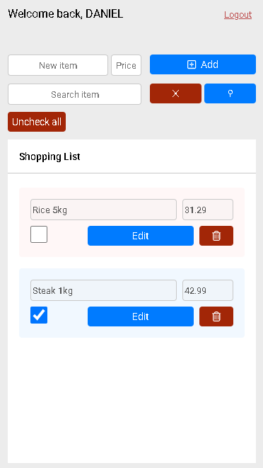
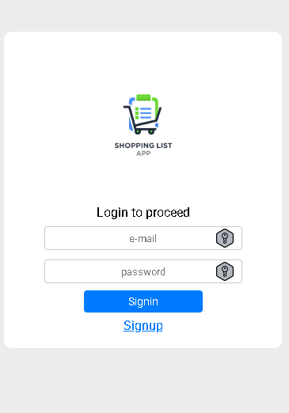

 

# Shopping List 📋🔗

A Shopping List APP that I make to help myself some years ago (and others with same use case) to keep organized my
shopping list. Every month, I go to the market with my wife to build monthly supplies (food, etc) and there was a
problem that ever come over and over. What should we buy? Are we forgetting about something? Last month what was the
price of this product? is cheaper or more expensive now? Then, I think: "i'm a programmer, what not build a tool do
solve this problem?"

## ✨ Features

- Add items with product name and prie
- Edit items
- Delete items
- Mark item as "checked", useful when you are on the shop
- Backend based search for items
- Unmark all items at once with one button
- Clean and responsive UI built with ReactJS and CSS.
- All data are persistent by the backend, [here](https://github.com/danieltvaz/shopping-list-api). Important: the entire
  application are hosted on my personal AWS infrastructure, so I **do not** will give you any kind of support to who
  decide to use this application, but I'm open to receive suggestions and bug reports.

## 🧑‍💻 Technologies

- [ReactJS](https://react.dev/) — UI Logic & Reactivity
- [CSS](https://www.w3.org/Style/CSS/Overview.en.html) — UI styling & Responsive Design
- [React Router](https://reactrouter.com/) — Page Routing & Auth Middleware
- [TypeScript](https://www.typescriptlang.org/) - Main language
- [Docker](https://www.docker.com/) / [Podman](https://podman.io/) — containerization
- [AWS EC2](https://aws.amazon.com/ec2/) — hosting provider
- [AWS RDS - MySQL](https://aws.amazon.com/rds/) — database
- [GitHub Actions](https://github.com/features/actions) — CI/CD automation
- [Nginx](https://www.nginx.com/) — reverse proxy & static server
- [Certbot](https://certbot.eff.org/) — HTTPS certificate generation and renewal

## 👤 Who is this project for?

Anyone who needs a way to organize and control a shopping list, for free.

## ☁️ Infrastructure

The application runs on an AWS EC2 instance, use MySQL RDS instance as database and uses a GitHub Actions workflow for
CI/CD.

## 📦 Installation and Execution

To run this project locally, ensure you have **Docker** or **Podman** installed.

### Steps to Run

1. Clone the repository:

```bash
 git clone https://github.com/danieltvaz/shopping-list-frontend
 cd shopping-list-frontend
```

Run the containers:

- If you're using Docker:

```
./run-docker.sh
```

- If you're using Podman:

```
./run-podman.sh
```

Make the script executable if needed:

```
chmod +x ./run-{docker,podman}.sh
```

- The backend will be available at http://localhost:3000
- The frontend will be available at http://localhost:3001

📂 Relevant Project Structure

```
root
├── src/
├── etc...
├── README.md
└── ./run-{docker,podman}.sh
```
